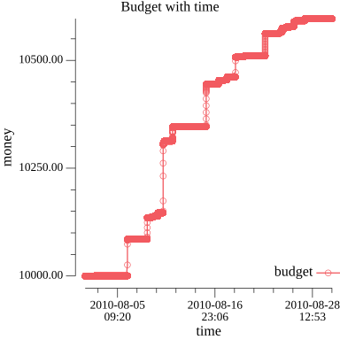
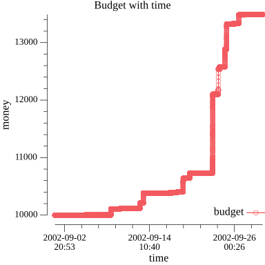
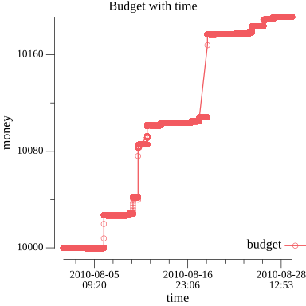
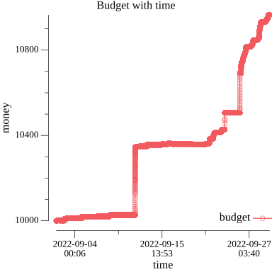

# Currency Arbitrage
Economics project

### Algorithm

---

Used featured Ford-Bellman algorithm for finding negative cycle in graph.
For every time tick generate graph with vertexes as currencies and edges as exchange rates.
Used ```-log(rate)``` on edge costs.

### Simulation

---

#### Data
Used data from https://www.histdata.com/. Simulated with 2002, 2010 and 2022 years.

**Simple algorithm** with 2010 August data:




**Fixed algorithm** with 2002/2010/2022 data:



